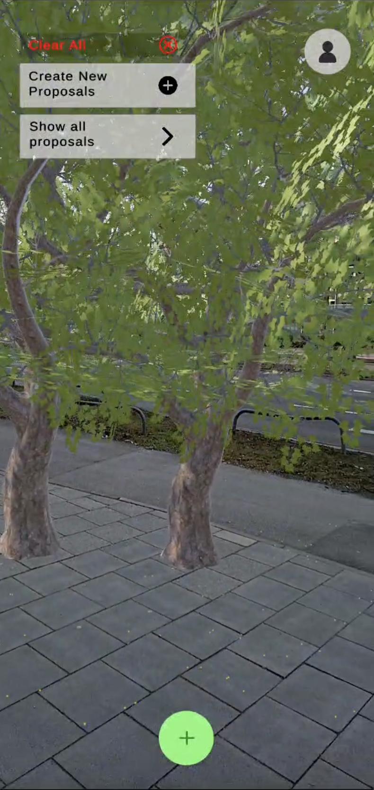

# AR City Plant Planner

## Project Overview
This project was developed as part of a **Group Project** for the **Human-Computer Interaction 2** course at **Ludwig Maximilian University of Munich (LMU) in the Winter Semester 2024/25**.

**AR City Plant Planner** is a **mobile augmented reality (AR) application** designed to enable **citizen participation in urban greenery planning**. The app allows users to create **interactive greenery space drafts**, place trees and ornamental plants, and vote on proposals, making urban planning more accessible and participatory.

## Features

- **AR-based Greenery Design** – Place trees and plants in an augmented reality environment.
- **Draft Creation & Editing** – Users can create, modify, and finalize urban greenery drafts.
- **Saving & Exporting** – Save drafts and export them as **JSON files** for further analysis.
- **Voting System** – Citizens can vote on drafts, enabling a participatory planning process.
- **User-Friendly UI** – Simple and intuitive interface for users with no professional background in urban planning.

## Demo Video
<a href="README_IMG/V1.mp4">
  
</a>

## Research Context

This project was developed to **explore the impact of AR on citizen participation in urban planning**. Traditional urban planning often suffers from **high bureaucratic barriers, lack of citizen engagement, and low accessibility**. Our goal is to investigate whether AR can:

- **Enhance user engagement in urban planning**
- **Increase participation quality compared to traditional planning tools**
- **Encourage more inclusive and sustainable urban design**

### Study Design

- **Experimental Study** with two groups:
  - **Group A**: Uses the AR City Plant Planner app to design urban greenery spaces.
  - **Group B**: Uses traditional tools like **paper maps and 2D planning software**.
- **Hypothesis**: Participants using AR tools will show **higher engagement and participation**.
- **Measured Variables**:
  - Time spent on tasks
  - Number of interactions with planning features
  - Collaboration & feedback-sharing behavior

## Tech Stack

### Development
- **Unity** – Game engine used for AR development.
- **AR Foundation** – Unity framework for building cross-platform AR applications.
- **C#** – Scripting language for app functionality.
- **JSON Serialization** – Used for saving and exporting greenery drafts.

### Platforms
- **Android** and **iOS** build capabilities 

## Setup & Installation

### Prerequisites

- **Unity 2021.3+** (or later)
- **Android SDK & NDK** (for building mobile applications)
- **AR Foundation & ARCore/ARKit** (installed via Unity Package Manager)

### Cloning the Repository
```bash
git clone <https://github.com/cristiangavriliu/ar-plant-planner.git>
cd <repository-directory>
```

### Opening in Unity
1. **Open Unity Hub** and click **Open Project**.
2. Select the cloned repository folder.
3. Wait for **Unity to load the dependencies**.

### Running the Application on Android
1. **Connect an Android device** with **USB Debugging enabled**.
2. In Unity, go to **File > Build Settings**.
3. Select **Android** as the target platform and click **Switch Platform**.
4. Click **Build and Run**.

### Running the Application on iOS
1. **Build for iOS in Unity** : In **Unity**, go to **File > Build Settings**, select **iOS**, and click **Build** to generate an Xcode project.

2. **Open in Xcode**: Open the generated project in **Xcode**, connect your **iPhone/iPad**, and select your device.

3. **Run on iOS Device**: Ensure a valid Apple Developer account is set under **Signing & Capabilities**, then click **Run (⌘R)** to install and launch the app.


## Data Management
- **Saving Drafts**: Users can save their **greenery space drafts** as **JSON files**.
- **Exporting Drafts**: JSON files can be shared for external review or further modifications.

## Future Perspectives & Challenges

- **Enhancing Voting Security** – Preventing manipulation in public voting.
- **Improving AR Functionality** – Stability improvements for better user experience.
- **Expanding to VR** – Investigating VR integration for a **fully immersive** city planning experience.

## Team Members

| Member     | Current Position |
| ------ | ------ |
| Franziska Krause | LMU, HCI M.Sc. |
| Cristian Gavriliu | LMU, HCI M.Sc. |
| Noah Ibers | LMU, HCI M.Sc. |

## License

This project is for **personal use only** and is intended as a reference point for the projects I have completed during my studies.


---


For further details, refer to the **final project report and study results**.

